# Experiments 

  

Applied a combination of RMSE, BCEwithLogitsLoss and Dice Loss on the DepthNet model. 
**Result**: Doesn't yeild good results!

### Predictions

|                 Segmentation Masks             |                 Depth Map                    | 
| :--------------------------------------------: | :------------------------------------------: |
|   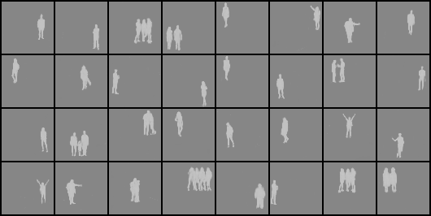             |     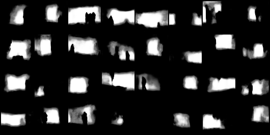       | 

### Results
|                 IOU                            |                 Validation Loss              |
| :--------------------------------------------: | :------------------------------------------: |
|   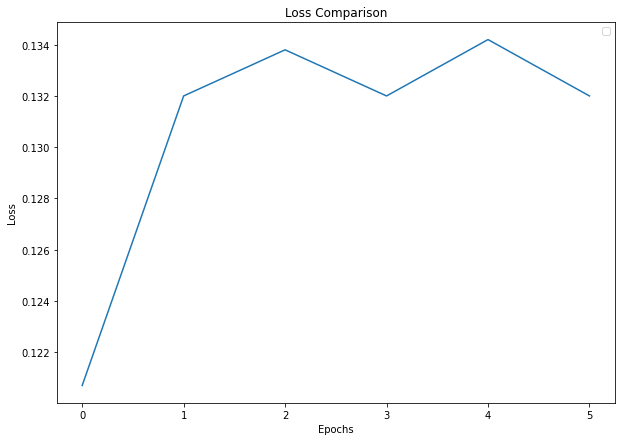                    |         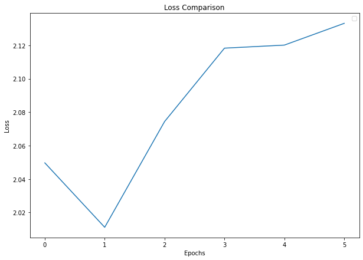          |

  

Applied enhanced BCEwithLogitsLoss with Rmse Loss and Learning Rate=0.01.
**Result**: Almost same results as that of DepthNet

### Predictions

|                 Segmentation Masks             |                 Depth Map                    | 
| :--------------------------------------------: | :------------------------------------------: |
|   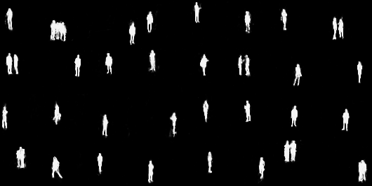         |   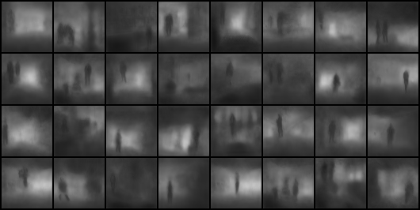     | 

### Results
|                 IOU                            |                 Validation Loss              |
| :--------------------------------------------: | :------------------------------------------: |
|   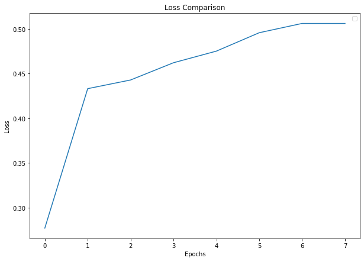                |         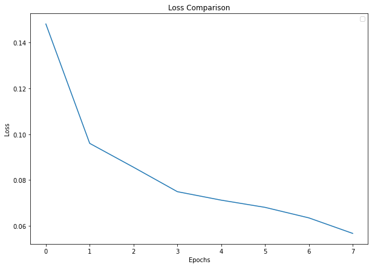      |

### Predictions

Applied Data Augmentation 
- HueSaturationValue
- RandomBrightnessContrast
**Result**: Predicted images are blurry! There is no necessity to use data augmentation transformations as the network is not over fitting.

### Predictions

|                 Segmentation Masks             |                 Depth Map                    | 
| :--------------------------------------------: | :------------------------------------------: |
|   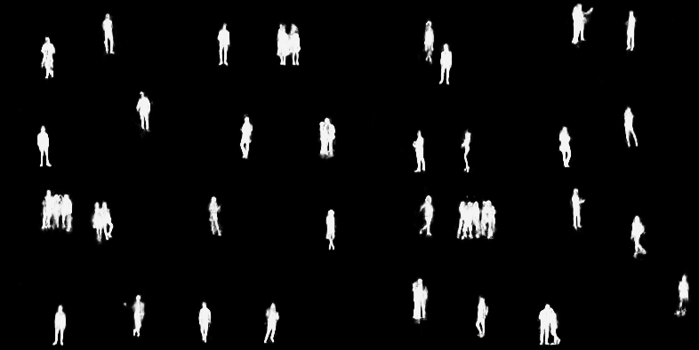            |    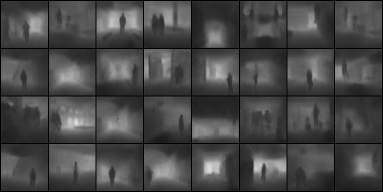       | 

### Results
|                 IOU                            |                 Validation Loss              |
| :--------------------------------------------: | :------------------------------------------: |
|   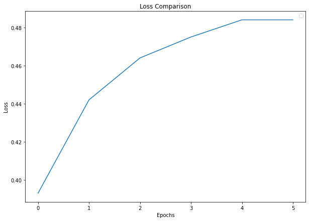                   |         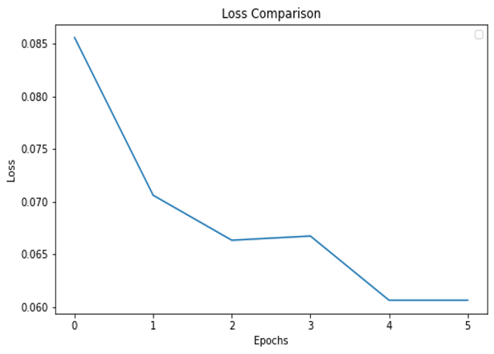      
   |
### Predictions

Created a architecture similar to U-NET, applied a combination of BCEWithLogitsLoss and SSIM
**Result**: Results were similar to DepthNet, but since there are more than 3x parameters in U-NET, so I preferred DepthNet.

### Predictions

|                 Segmentation Masks             |                 Depth Map                    | 
| :--------------------------------------------: | :------------------------------------------: |
|   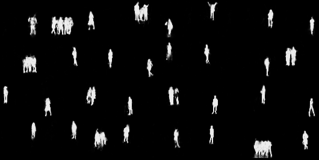             |    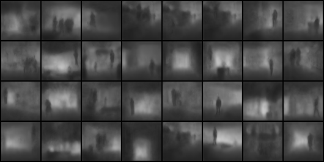        | 

### Results
|                 IOU                            |                 Validation Loss              |
| :--------------------------------------------: | :------------------------------------------: |
|   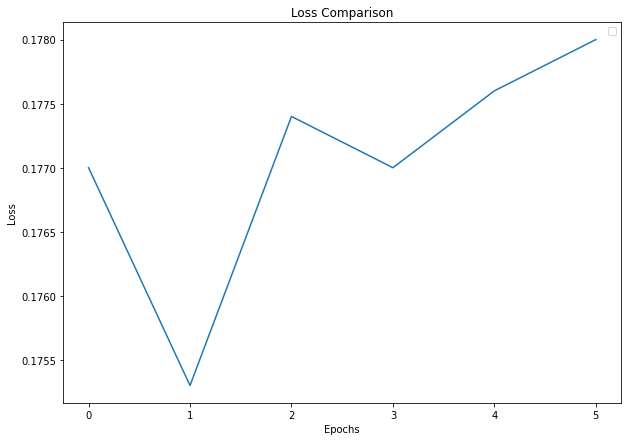                  |         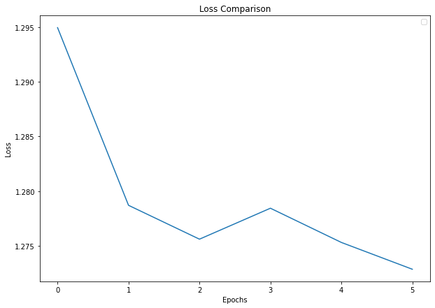        |
