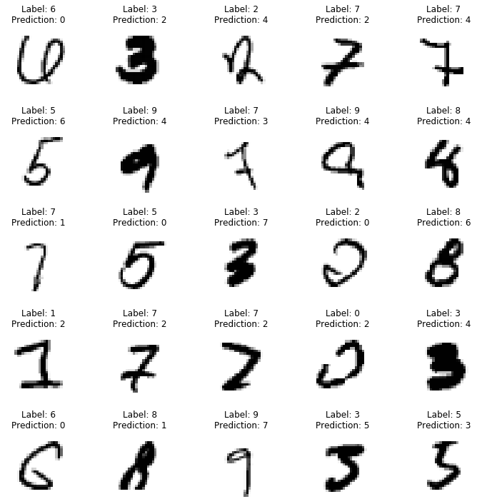

# Session 7 (Part 1) - Regularization

The goal of this assignment is to convert the code from the [previous](../S6/) session into a library where each functionality of the code must be present in a separate file. The main file should only contain the configuration parameters and call the required functions to execute the model.

## Model Architecture

### Parameters and Hyperparameters

- Kernel Size: 3x3
- Loss Function: Negative Log Likelihood
- Optimizer: SGD
- Dropout Rate: 0.01
- Batch Size: 64
- Learning Rate: 0.01
- **L1 Factor:** 0.001
- **L2 Factor:** 0.0001

## Results

### Change in Validation Loss and Accuracy

## Misclassified Images

### With L1 Regularization

### With L2 Regularization

## Project Setup

- Install the required packages  
  `$ pip install -r requirements.txt`

- To run the model with default parameters  
  `$ python main.py`

To see more options for executing the model, run  
 `$ python main.py --help`

## Group Members

- Shantanu Acharya (Canvas ID: 25180630)
- Rakhee (Canvas ID: 25180625)
